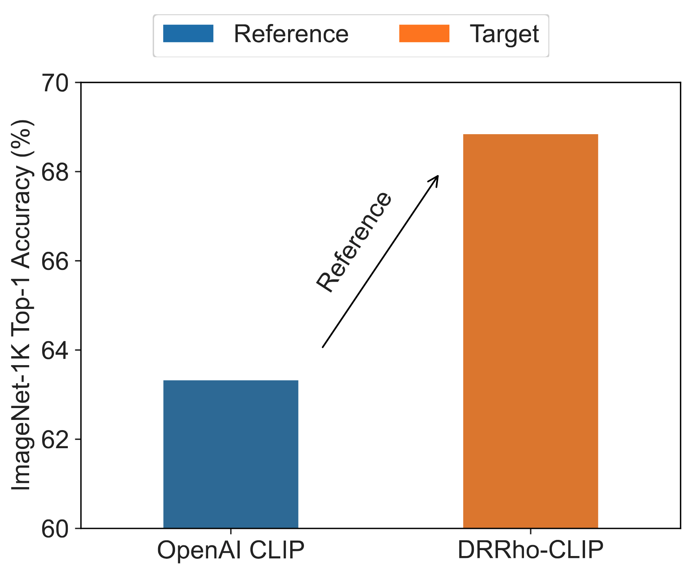
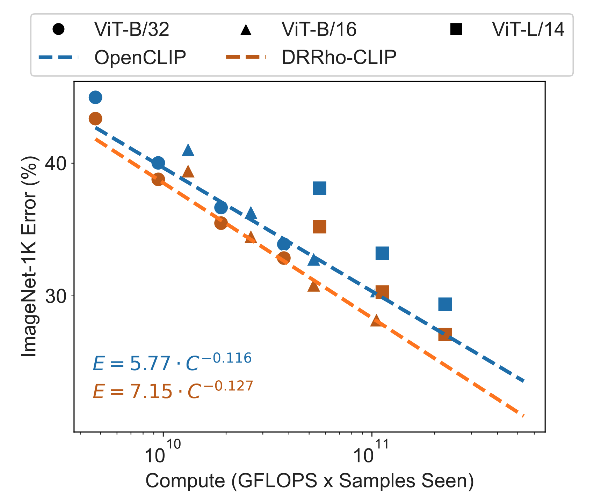

<h1 align="center">Model Steering: Learning with a Reference Model Improves Generalization Bounds and Scaling Laws</h1>

Paper link: [arXiv](https://arxiv.org/abs/2505.06699)


**How can we leverage public models to improve training of a target model on custom datasets?**

- We formalize an emerging learning paradigm that uses a trained model as a reference to guide and enhance the training of a target model through strategic data selection or weighting, named **model steering**.
- We propose a theory-driven framework for model steering called **DRRho risk minimization**, which is rooted in Distributionally Robust Optimization (DRO) and RHO loss.
- We provide theoretical insights into why this approach improves generalization and data efficiency compared to training without a reference model.
- We introduce a novel method for Contrastive Language-Image Pretraining (CLIP) with a reference model, termed DRRho-CLIP.
- We trained a DRRho-CLIP model (ViT-B/16)  on 192M data (1.28B samples seen) in 2 days on 8 H100, achieving 5.52% improvement over a weaker reference model, i.e., OpenAI CLIP  model (ViT-B/32) that was trained on 400M data (12.8B samples seen) with 256 V100 GPUs.
- Model steering and DRRho risk minimization offers weak to strong generalization.
- DRRho-CLIP has a better scaling law than OpenCLIP. 

**Table of Contents**
- [Experimental Results](#experimental-results)
- [Getting Started](#getting-started)
    - [Environment Setup](#environment-setup)
    - [Training](#training)
    - [Evaluation](#evaluation)
- [Citing DRRho](#citing-drrho)

## Experimental Results

**Weak to strong generalization**: The following figure presents a comparison between a target model (ViT-B/16) trained by the proposed DRRho-CLIP and the reference model it leverages. OpenAI CLIP (ViT-B/32) was trained on a private 400M dataset with 12.8B samples seen and 32768 batch size. DRRho-CLIP model was trained on DFN-192M with 1.28B samples seen and 5120 batch size, and using OpenAI CLIP as a reference model.

<p align="center"></p>

**Scaling performance** of OpenCLIP and the proposed DRRho-CLIP, which uses the OpenAI CLIP model (ViT-B/32) as the reference model. We conduct experiments of the two methods under different settings to fit scaling laws, as shown in the bottom left corner

<p align="center"></p>

## Getting Started

### Environment Setup

To set up the environment for training, please
1. Download this repository:
    ```bash
    git clone https://github.com/Optimization-AI/DRRho-CLIP.git
    cd DRRho-CLIP
    ```
2. Create a new environment:
    ```bash
    conda create -n fastclip python=3.11
    conda activate fastclip
    pip install -r requirements-training.txt
    ```

### Training

We present sample slurm scripts to run DRRho-CLIP and FastCLIP on DFN-192M.

<details open>
    <summary>Sample script to run <b>DRRho-CLIP</b> with OpenAI ViT-B/32 as reference model on DFN-192M using 8 GPUs (2 nodes and 4 GPUs per node)</summary>

```bash
#!/bin/bash
#SBATCH --time=2-00:00:00
#SBATCH --mem=120G
#SBATCH --nodes=2
#SBATCH --gres=gpu:4
#SBATCH --ntasks-per-node=6
#SBATCH --cpus-per-task=6
#SBATCH --wait-all-nodes=1
#SBATCH --job-name=drrho_clip
#SBATCH --partition=gpu
#SBATCH --output=%x_%j.log

source ~/.bashrc
conda activate fastclip

master_addr=$(scontrol show hostnames "$SLURM_JOB_NODELIST" | head -n 1)
export MASTER_ADDR=$master_addr
export MASTER_PORT=12805

export CUDA_VISIBLE_DEVICES='0,1,2,3'
export PYTHONPATH="$PYTHONPATH:$PWD/src"
export HUGGINGFACE_HUB_CACHE='./checkpoints/huggingface'

srun python -u src/training/main.py \
    --save-frequency 1 \
    --train-data './datasets/dfn2b/large/shards/000{00000..19245}.tar::./datasets/dfn2b/large_disjoint/shards/000{19246..29794}.tar' \
    --train-num-samples 192160462 --data_size 255020000 \
    --warmup 500 \
    --batch-size 640 \
    --epochs 7 \
    --workers 6 \
    --model ViT-B-16 \
    --name drrho_clip \
    --seed 2025 \
    --wd 0.2 \
    --local-loss \
    --fastclip --multiply_tau --temperature_scheme global_constant --temperature 0.01 \
    --lr 3.125e-4 --lr_tau 0.0 --lr_tau_scheduler const --rho 11.0 --fastclip_eps 1e-4 \
    --gamma 1.0 --gamma_schedule cosine --gamma_decay_epochs 7 \
    --ref_model ViT-B-32 --ref_model_pretrained openai
```

</details>

<details open>
    <summary>Sample script to run <b>FastCLIP</b> on DFN-192M using 8 GPUs (2 nodes and 4 GPUs per node)</summary>

```bash
#!/bin/bash
#SBATCH --time=2-00:00:00
#SBATCH --mem=120G
#SBATCH --nodes=2
#SBATCH --gres=gpu:4
#SBATCH --ntasks-per-node=6
#SBATCH --cpus-per-task=6
#SBATCH --wait-all-nodes=1
#SBATCH --job-name=fastclip
#SBATCH --partition=gpu
#SBATCH --output=%x_%j.log

source ~/.bashrc
conda activate fastclip

master_addr=$(scontrol show hostnames "$SLURM_JOB_NODELIST" | head -n 1)
export MASTER_ADDR=$master_addr
export MASTER_PORT=12805

export CUDA_VISIBLE_DEVICES='0,1,2,3'
export PYTHONPATH="$PYTHONPATH:$PWD/src"
export HUGGINGFACE_HUB_CACHE='./checkpoints/huggingface'

srun python -u src/training/main.py \
    --save-frequency 1 \
    --train-data './datasets/dfn2b/large/shards/000{00000..19245}.tar::./datasets/dfn2b/large_disjoint/shards/000{19246..29794}.tar' \
    --train-num-samples 192160462 --data_size 255020000 \
    --warmup 500 \
    --batch-size 640 \
    --epochs 7 \
    --workers 6 \
    --model ViT-B-16 \
    --name fastclip \
    --seed 2025 \
    --wd 0.2 \
    --local-loss \
    --fastclip --multiply_tau --temperature_scheme global_learnable \
    --lr 3.125e-4 --lr_tau 7.8125e-5 --lr_tau_scheduler step_thresh --rho 11.0 \
    --gamma 1.0 --gamma_schedule cosine --gamma_decay_epochs 7
```

</details>

**Non-slurm Training**: For non-slurm training, please set `master_addr` manually (e.g., `127.0.0.1`), change `srun python -u src/training/main.py` to `cd src && torchrun --nproc_per_node=4 --rdzv_endpoint=$master_addr -m training.main`, and run the above script with `/bin/bash`.

**Custom Data Training**: To train on your own data, you need to modify the following options

- `--train-data`: the path to the training data, currently only **webdataset** format is supported.
- `--train-num-samples`: this many samples will be seen for one epoch, we recommend to set it to the actual size of the dataset.
- `--data_size`: the original size of the dataset, this may take a value different from `--train-num-samples`. In the case of DFN-192M, we attempted to download 255M image-URL/caption pairs, and 192M of them were successfully downloaded. So we set `--data_size` to 255,020,000 and set `--train-num-samples` to 192,160,462.
- `--epochs`: for this many epochs the model will be trained.
- `--gamma`: the value of $\gamma$ used by FastCLIP. We recommend to set it following $\gamma= \min(1.0, 4.177\cdot E^{-0.7265})$, where $E$ is the number of epochs.
- `--gamma_decay_epochs`: for this many epochs $\gamma$ will decrease from 1.0 to `--gamma`. We recommend to set it to `--epochs`.

### Evaluation

We leverage the [Datacomp](https://www.datacomp.ai/dcclip/index.html#home) benchmark to evaluate the performance of trained models. We refer the users to their [GitHub repository](https://github.com/xywei00/datacomp) for detailed instructions on how to run the evaluation. Alternatively, we provide a modified fork to simplify the evaluation process. To run the evaluation, please first prepare the environment, clone the repository and download the evaluation datasets:
```bash
# create the evaluation environment
env_name='fastclip_eval'
conda create -n "$env_name" python=3.11
conda activate "$env_name"
pip install -r requirements-eval.txt

# clone the datacomp repository
git clone -b project git@github.com:xywei00/datacomp.git

# download the evaluation datasets to `./datasets/datacomp`
python ./datacomp/download_evalsets.py ./datasets/datacomp
```
To evaluate a trained CLIP model at epoch 30, run the following command:
```bash
# train_output_dir should be the one containing 'checkpoints', 'out.log', etc.
train_output_dir='./logs/name'
data_dir='./datasets/datacomp'
arch='ViT-B-16'
epoch=30

python ./datacomp/evaluate.py --train_output_dir "${train_output_dir}" --data_dir "${data_dir}" --epoch "${epoch}" --arch "${arch}"
```

## Citing DRRho

If you find DRRho useful in your research, please consider citing the following paper:
```bibtex
@article{wei2024model,
  title={Model Steering: Learning with a Reference Model Improves Generalization Bounds and Scaling Laws},
  author={Wei, Xiyuan and Lin, Ming and Ye, Fanjiang and Song, Fengguang and Cao, Liangliang and Thai, My T. and Yang, Tianbao},
  journal={arXiv preprint arXiv:2505.06699},
  year={2025}
}
```
